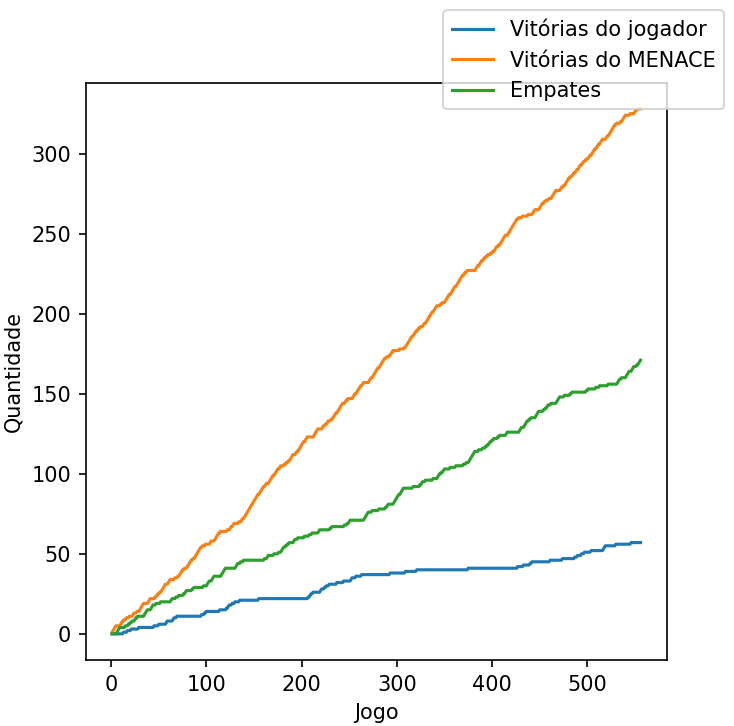
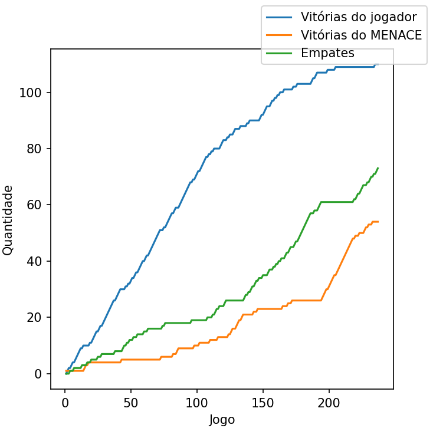
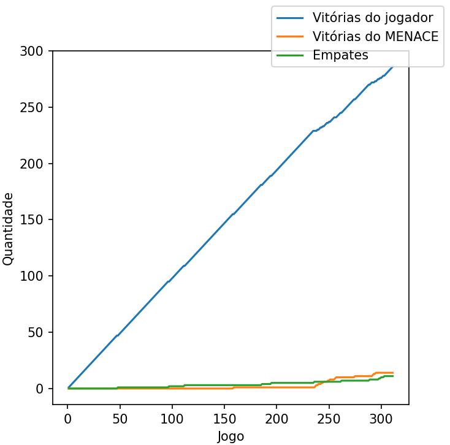
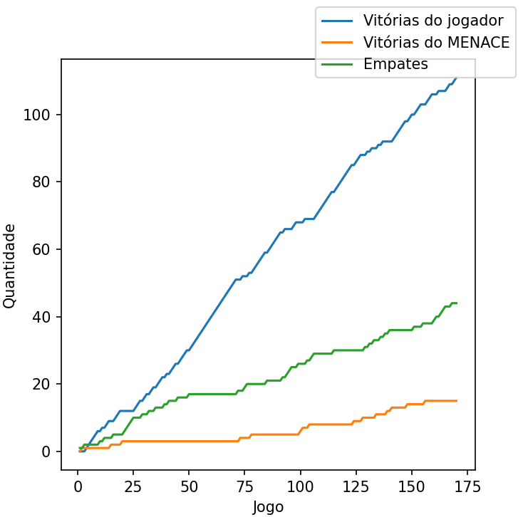

# Guia para os brains do MENACE:

O MENACE já foi treinado em diversas ocasiões, em diferentes máquinas, por diferentes pessoas! Aqui está um guia rápido em forma de tabela para facilitar a identificação de cada conjunto `brain.pickle` e `history.pickle`:

|          Identificação           |            Evento           |       Base         | Quem joga primeiro |
|:--------------------------------:|:---------------------------:|:------------------:|:------------------:|
|        [CA.A](#caa-brain)        |     Ciência Aberta 2023     |         -          |       MENACE       |
|        [CA.J](#caj-brain)        |     Ciência Aberta 2023     |         -          |       MENACE       |
| [IPA.A](#ipaa-brain-e-histórico) | Ilum de Portas Abertas 2023 | [CA.A](#caa-brain) |       MENACE       |
| [IPA.D](#ipad-brain-e-histórico) | Ilum de Portas Abertas 2023 |         -          |       MENACE       |
| [IPA.J](#ipaj-brain-e-histórico) | Ilum de Portas Abertas 2023 |         -          |       jogador      |
| [IPA.T](#ipat-brain-e-histórico) | Ilum de Portas Abertas 2023 |         -          |       MENACE       |

## Visão mais detalhada

#### CA.A ([brain](./files/assets/dados/brain_CA_A.pickle)):

Treinado do zero durante o evento Ciência Aberta do CNPEM em junho de 2023 (Linux) - MENACE realiza a primeira jogada;

#### CA.J ([brain](brain_CA_J.pickle)):

Treinado do zero durante o evento Ciência Aberta do CNPEM em junho de 2023 (Windows) - MENACE realiza a primeira jogada;

#### IPA.A ([brain](./files/assets/dados/brain_IPA_A.pickle) e [histórico](./files/assets/dados/history_IPA_A.pickle)):

Treinado com base no [CA A](#ca-a-pickle) durante o evento Ilum de Portas Abertas em setembro de 2023 (Linux) - MENACE realiza a primeira jogada;

**Desempenho e estatísticas:**

#### IPA.D ([brain](./files/assets/dados/brain_IPA_D.pickle) e [histórico](./files/assets/dados/history_IPA_D.pickle)):

Treinado do zero durante o evento Ilum de Portas Abertas em setembro de 2023 (Linux) - MENACE realiza a primeira jogada;

**Desempenho e estatísticas:**

#### IPA.J ([brain](./files/assets/dados/brain_IPA_J.pickle) e [histórico](./files/assets/dados/history_IPA_J.pickle)):

Treinado do zero durante o evento Ilum de Portas Abertas em setembro de 2023 (Linux) - o jogador realiza a primeira jogada;

**Desempenho e estatísticas:**

#### IPA.T ([brain](./files/assets/dados/brain_IPA_T.pickle) e [histórico](./files/assets/dados/history_IPA_T.pickle)):

Treinado do zero durante o evento Ilum de Portas Abertas em setembro de 2023 (Linux) - MENACE realiza a primeira jogada.

**Desempenho e estatísticas:**

